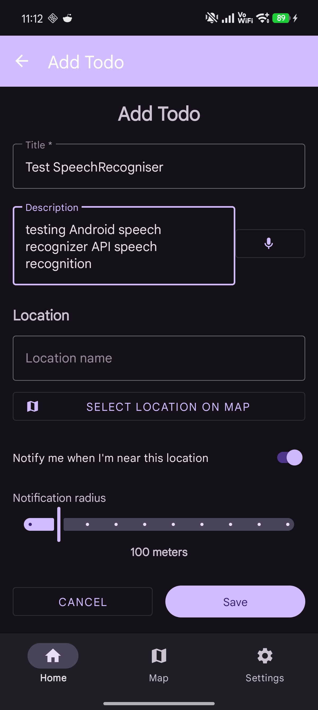
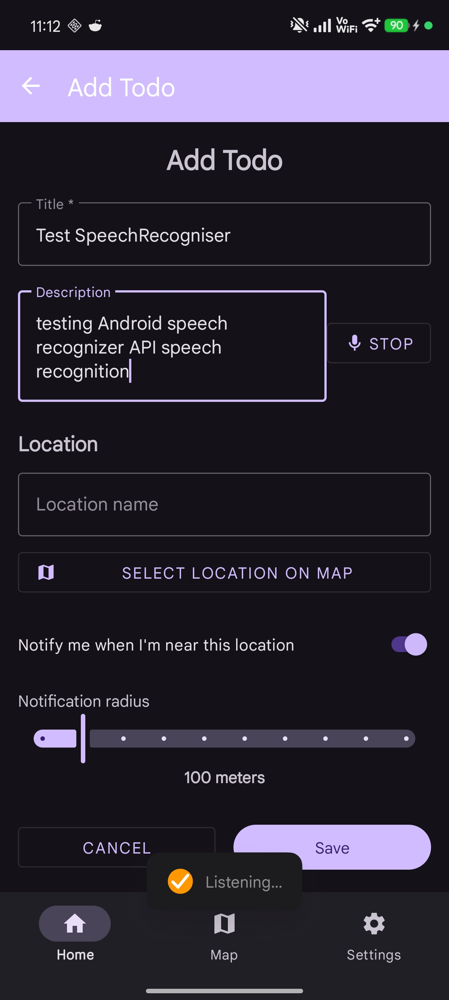

# Android SpeechRecognizer API

## Opis tehnologije

**Android SpeechRecognizer API** je sistemski Android API, ki omogoča pretvorbo govora v besedilo (Speech-to-Text).  
Uporablja se za glasovne ukaze, vnos besedila z govorom in interakcijo z uporabnikom brez uporabe tipkovnice.

API deluje kot vmesnik do sistemskega ali oblačnega prepoznavanja govora (odvisno od naprave in nastavitev uporabnika).

Uradna dokumentacija:  
https://developer.android.com/reference/android/speech/SpeechRecognizer

---

## Utemeljitev izbire

Tehnologijo **SpeechRecognizer API** sem izbral, ker:

- je del uradnega Android SDK
- ne zahteva zunanjih knjižnic
- omogoča enostavno integracijo glasovnega upravljanja
- je primerna za sodobne mobilne aplikacije (dostopnost, hands-free uporaba)

Primeri uporabe:
- glasovno dodajanje opravil
- iskanje z govorom
- upravljanje aplikacije brez dotika

---

## Prednosti

- vgrajena podpora v Android (ni dodatnih odvisnosti)
- brezplačna uporaba
- podpora več jezikom
- deluje tudi brez lastnega strežnika
- nizka zakasnitev pri prepoznavi

---

## Slabosti

- zahteva internetno povezavo (v večini primerov)
- natančnost je odvisna od mikrofona in okolja
- omejen nadzor nad samim modelom prepoznavanja
- ne deluje na emulatorjih brez Google storitev

---

## Licenca

SpeechRecognizer API je del **Android Open Source Project (AOSP)**.

Licenca:
- **Apache License 2.0**

Uporaba je dovoljena brez omejitev za komercialne in nekomercialne projekte.

---

## Število uporabnikov

SpeechRecognizer API uporablja veliko Android aplikacij, saj je del osnovnega operacijskega sistema. Je en od najpogosteje uporabljenih Android API-jev.

API se uporablja v aplikacijah, kot so:
  - Google Assistant
  - Google Search
  - navigacijske in produktivne aplikacije

---

## Časovna in prostorska zahtevnost

### Časovna zahtevnost
- Prepoznavanje govora poteka v realnem času
- Čas obdelave je približno **O(n)** glede na dolžino govornega signala

### Prostorska zahtevnost
- Minimalna poraba pomnilnika na strani aplikacije
- Večina obdelave poteka v sistemskih storitvah ali v oblaku
- Prostorska zahtevnost je **O(n)** glede na dolžino zvočnega zapisa

---

## Vzdrževanje tehnologije

- Razvijalec: **Google**
- Število razvijalcev: več deset (Android framework ekipa)
- Tehnologija se redno posodablja skupaj z Android SDK
- Zadnje spremembe so del vsake nove Android verzije

API je stabilen in dolgoročno podprt.

---

## Postopek implementacije

### 1. Dodajanje dovoljenj

V `AndroidManifest.xml` dodamo dovoljenje za mikrofon:

```xml
<uses-permission android:name="android.permission.RECORD_AUDIO" />
```


---

## Primer kode v moji aplikaciji (Kotlin)


---


---


---


---


---

## Primer v aplikaciji TodoMap

<p>
  
  
</p>

